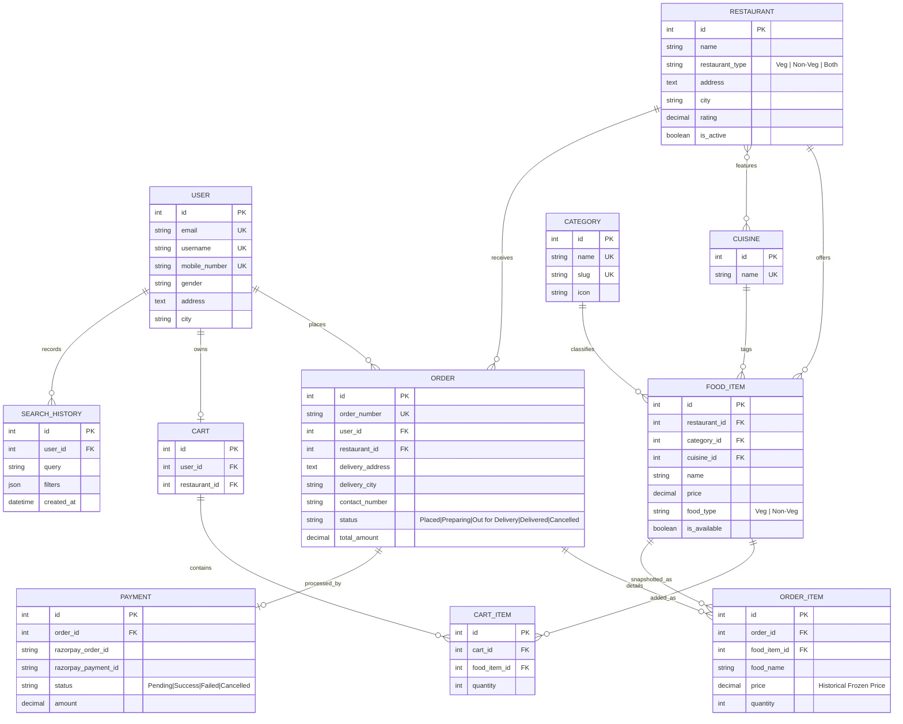

# 🍔 MealMate — Online Food Delivery System

[](https://www.python.org/)
[](https://www.djangoproject.com/)
[](https://www.mysql.com/)
[](https://getbootstrap.com/)
[](https://pytest.org/)
[]()

> A full-stack, enterprise-grade online food delivery platform (Swiggy / Zomato style) built with **Python 3.11+**, **Django 5**, **MySQL 8**, **Bootstrap 5**, **Razorpay Payments**, and a **Content-Based Machine Learning Recommendation Engine** powered by `scikit-learn`.

---

## 📋 Table of Contents
1. [Tech Stack](#-tech-stack)
2. [Key Features](#-key-features)
3. [Business Rules Enforced](#-business-rules-enforced)
4. [Database Architecture & ER Diagram](#-database-architecture--er-diagram)
5. [Recommendation Engine Architecture](#-recommendation-engine-architecture)
6. [Project Structure](#-project-structure)
7. [Installation & Setup Guide](#-installation--setup-guide)
8. [Database Seeding](#-database-seeding)
9. [Running the Test Suite](#-running-the-test-suite)
10. [Default Credentials](#-default-credentials)
11. [API Endpoints Reference](#-api-endpoints-reference)

---

## 🛠️ Tech Stack

| Layer | Technologies |
|---|---|
| **Backend Framework** | Python 3.11+, Django 5.2, Django REST Framework |
| **Database** | MySQL 8.0 (Django ORM with PyMySQL bridge & strict transactional migrations) |
| **Authentication** | Django Auth + `django-allauth` (Email/Password, 10-digit Indian Mobile regex, Google OAuth2) |
| **Frontend UI** | Django Templates, Bootstrap 5.3, Bootstrap Icons, Vanilla JS (Fetch API) |
| **Payments Gateway** | Razorpay Test Mode SDK (Checkout, HMAC-SHA256 signature verification, Success / Failed / Cancel flows) |
| **Recommendation Engine** | `scikit-learn` (TF-IDF Vectorizer, Cosine Similarity), `pandas`, `numpy` |
| **Environment Configuration** | `python-decouple` (`.env` for all keys & DB credentials; zero hardcoded secrets) |
| **Testing Suite** | `pytest`, `pytest-django` (96 automated test cases) |

---

## ✨ Key Features

### 1. User & Authentication
- **Secure Registration**: Full name, unique email, 10-digit Indian mobile number (`^[6-9]\d{9}$`), gender, delivery address, city, and strong password.
- **Flexible Sign In**: Log in using either registered **Email** or **Username**.
- **Google OAuth2**: One-click social sign-in powered by `django-allauth`.
- **Editable Profile**: Update mobile, address, gender, and personal preferences with server-side validation.

### 2. Search & Multi-Faceted Filtering
- **Unified Search Bar**: Single search box that searches both **food dishes** and **restaurant names** concurrently (partial matches, case-insensitive).
- **Combinable Filters**:
  - Dietary: Pure-Veg only (`🥦`), Non-Veg only (`🍗`), or All.
  - Cuisine: South Indian, North Indian, Mughlai, Chinese, Italian, Street Food, Fast Food, Desserts & Beverages.
  - Category: Veg, Non-Veg, Snacks / Street-Style Food, Desserts, Beverages.
  - Price Range: Custom minimum (₹) and maximum (₹) sliders/inputs.
- **Search History Tracking**: Stores the user's last 20 unique search queries in `SearchHistory` for personalized recommendations.

### 3. Shopping Cart & Single-Kitchen Policy
- **One Restaurant per Cart**: Users can only order from a single restaurant at a time.
- **Conflict Warning Modal**: If a user attempts to add a dish from another restaurant, a friendly modal warns them: *"Your cart has items from X. Replace with Y?"* with a one-click *"Clear & Add New"* option.
- **Fetch API Cart Controls**: Real-time quantity updates (`+` / `-`), item removal, and subtotal calculation without full-page reloads.

### 4. Orders & Payment Flow
- **Historical Price Snapshotting**: `OrderItem` stores an immutable snapshot of `food_name` and `price`. Subsequent price adjustments by restaurants never alter historic order receipts.
- **Razorpay Integration**: Official Razorpay Checkout integration with test keys, HMAC-SHA256 signature verification, and simulator triggers for fast local development.
- **Guarded Order Cancellation**: Customers can cancel an order **only while it is in the `Placed` status**. Once the restaurant kitchen marks the order as `Preparing`, cancellation is strictly locked.
- **Live Status Tracking**: Visual progress bar tracking order stages: `Placed` ➔ `Preparing` ➔ `Out for Delivery` ➔ `Delivered` (or `Cancelled`).

### 5. Dashboards
- **Customer Dashboard (`/dashboard/user/`)**:
  - Live active delivery alert banner with real-time status.
  - Summary KPI cards: Total Orders, Total Spent (₹), Active Deliveries, Cart Items.
  - Recent order history table and recent search shortcuts.
  - Account profile summary with one-click edit link.
  - Personalized *"Recommended For You"* dishes.
- **Staff / Admin Dashboard (`/dashboard/admin/`)**:
  - 6 Key Business Metrics: Total Revenue (₹), Total Orders Placed, Active Kitchen Orders, Registered Customers, Partner Restaurants, Total Dishes on Menu.
  - **Top-Selling Food Items Analytics**: Ranks dishes by total units sold and gross revenue generated.
  - **Live Orders Management Table**: Inline status transition dropdown (`Placed` ➔ `Preparing` ➔ `Out for Delivery` ➔ `Delivered`) to update kitchen statuses directly.
  - Quick action links to Food Items Catalog, Partner Restaurants, and Categories.

---

## 🔒 Business Rules Enforced

1. **Pure-Veg Restaurant Constraint**: A restaurant registered as `Veg` **cannot** have Non-Veg food items. Enforced both at the database model level (`FoodItem.clean()`) and in the admin form (`FoodItemAdminForm`).
2. **No Orphan Street Vendors**: All street food and snack items (e.g., Vada Pav, Pav Bhaji, Samosa) strictly belong to registered hotel/restaurant foreign keys (`restaurant_id` is non-nullable).
3. **Price Always Displayed**: Price is prominently displayed on every food card across the homepage, search results, restaurant menus, cart, and recommendations.
4. **IDOR Security**: Users can only view and manage their own cart, orders, and profile records.

---

## 🗄️ Database Architecture & ER Diagram



---

## 🧠 Recommendation Engine Architecture

The hybrid recommendation engine (`recommender/engine.py`) provides personalized suggestions via `get_recommendations(user, limit=8)`:

```
[User Signals]
  ├─ Last 10 Orders (Weight: 3.0 × Recency Decay: 1.0 → 0.4)
  ├─ Active Cart Items (Weight: 2.0)
  └─ Search Queries & Filters (Weight: 1.0 × Recency Decay)
          │
          ▼
[User Profile Weighted Token Document]
          │
          ▼
[TfidfVectorizer: 1500 Features] ──> [Cosine Similarity Matrix]
          │
          ▼
[Strict Filter Rules]
  ├─ Pure-Veg Guarantee: If user orders only veg, NEVER return non-veg
  ├─ Cart Exclusion: Exclude dishes already in active cart
  └─ Availability Filter: Only active kitchens and in-stock dishes
          │
          ▼
[Hybrid Blending] ──> Top Candidates + Cold-Start Popularity Backfill
```

---

## 📂 Project Structure

```
Meal Management/
├── README.md                          # Comprehensive project documentation
├── requirements.txt                   # Frozen production dependencies
├── .gitignore                         # Git exclusion rules
├── backend/
│   ├── manage.py                      # Django management script
│   ├── pytest.ini                     # Pytest configuration
│   ├── .env                           # Secret credentials (MySQL, Razorpay, Django)
│   ├── .env.example                   # Template environment variables
│   ├── mealmate/                      # Project root configuration
│   │   ├── __init__.py                # PyMySQL bridge initialization
│   │   ├── settings.py                # Django 5 + DRF + allauth settings
│   │   ├── urls.py                    # Root URL router
│   │   └── wsgi.py
│   ├── accounts/                      # Auth, User model, Registration, Profile
│   ├── restaurants/                   # Restaurant, Cuisine models, Seed command
│   ├── menu/                          # Category, FoodItem, Search service, Admin CRUD
│   ├── cart/                          # Cart, CartItem, Single-kitchen service
│   ├── orders/                        # Order, OrderItem, Payment, Razorpay service
│   ├── recommender/                   # ML Engine (TF-IDF, Cosine Similarity, SearchHistory)
│   ├── dashboard/                     # Customer & Staff Administration Dashboards
│   ├── templates/                     # Bootstrap 5 Responsive Templates
│   │   ├── base.html                  # Global layout, navbar, toasts, conflict modal
│   │   ├── home.html                  # Hero, categories, restaurants, recommended, featured
│   │   ├── accounts/                  # Sign in, Sign up, Profile, Forgot Password
│   │   ├── restaurants/               # Restaurant listing & detail views
│   │   ├── menu/                      # Food listing, detail, search results, admin CRUD
│   │   ├── cart/                      # Interactive shopping cart
│   │   ├── orders/                    # Checkout, Razorpay payment, tracking, success
│   │   ├── dashboard/                 # User dashboard & Admin analytics dashboard
│   │   └── recommender/               # Dedicated recommendations page
│   └── tests/                         # Full automated test suite (96 tests)
│       ├── test_phase1_models.py
│       ├── test_phase2_auth.py
│       ├── test_phase3_restaurants_menu.py
│       ├── test_phase4_search.py
│       ├── test_phase5_cart_orders.py
│       ├── test_phase6_dashboard.py
│       └── test_phase7_recommender.py
```

---

## 🚀 Installation & Setup Guide

### 1. Prerequisites
- Python 3.11 or higher
- MySQL 8.0 Server running on port 3306
- Git

### 2. Clone the Repository
```bash
git clone https://github.com/chaitanmh24-cmyk/MealMate-Online-Food-Delivery-System.git
cd MealMate-Online-Food-Delivery-System
```

### 3. Create & Activate Virtual Environment
```bash
# Windows (PowerShell)
python -m venv backend\venv
.\backend\venv\Scripts\Activate.ps1

# Linux / macOS
python3 -m venv backend/venv
source backend/venv/bin/activate
```

### 4. Install Dependencies
```bash
cd backend
pip install -r requirements.txt
```

### 5. Configure MySQL Database & Environment Variables
Log in to MySQL and create the database:
```sql
CREATE DATABASE mealmate_db CHARACTER SET utf8mb4 COLLATE utf8mb4_unicode_ci;
```

Create a `.env` file inside the `backend/` directory (or copy from `.env.example`):
```ini
DEBUG=True
SECRET_KEY=django-insecure-mealmate-rebuild-secret-2026!@#
ALLOWED_HOSTS=127.0.0.1,localhost

# MySQL 8 Configuration
DB_ENGINE=mysql
DB_NAME=mealmate_db
DB_USER=root
DB_PASSWORD=your_mysql_password
DB_HOST=127.0.0.1
DB_PORT=3306

# Razorpay Test Mode
RAZORPAY_KEY_ID=rzp_test_sampleKey12345
RAZORPAY_KEY_SECRET=sampleSecretKey12345

# Google OAuth2 (Optional)
GOOGLE_CLIENT_ID=
GOOGLE_CLIENT_SECRET=
```

### 6. Apply Database Migrations
```bash
python manage.py migrate
```

---

## 🍽️ Database Seeding

Seed the database with **12 partner restaurants**, **8 authentic cuisines**, **5 categories**, and **52 realistic dishes** (with prices, descriptions, and high-resolution images):

```bash
python manage.py seed_data
```

*Output:*
```
--- Starting Clean Database Seeding ---
Loaded 8 cuisines.
Loaded 5 categories.
Loaded 12 partner restaurants.
Successfully seeded 52 food items across all restaurants!
--- Seeding Complete ---
```

---

## 🧪 Running the Test Suite

Run all automated unit and integration tests across all 7 phases:

```bash
pytest
```

*Test Results:*
```
tests/test_phase1_models.py .................
tests/test_phase2_auth.py ...........
tests/test_phase3_restaurants_menu.py .............................
tests/test_phase4_search.py ..........................
tests/test_phase5_cart_orders.py ..................
tests/test_phase6_dashboard.py .........
tests/test_phase7_recommender.py .......

======================== 96 passed in 112.35s ========================
```

---

## 🔑 Default Credentials

| Role | Username / Email | Password | Access |
|---|---|---|---|
| **Superuser / Staff Admin** | `admin` / `admin@mealmate.com` | `admin123` | Full Admin Dashboard & Django Admin |
| **New Customer** | Self-signup via `/auth/signup/` | Any strong password | Customer Dashboard, Cart, Orders |

---

## 🌐 API & URL Routes Reference

| Route | Method | Description |
|---|---|---|
| `/` | `GET` | Home page (Hero, Categories, Top Restaurants, Recommended, Featured) |
| `/restaurants/` | `GET` | Browse partner restaurants with dietary, cuisine, and city filters |
| `/restaurants/<id>/` | `GET` | Restaurant menu grouped by categories |
| `/menu/` | `GET` | Food item catalog with multi-filters and pagination |
| `/menu/search/` | `GET` | Unified search across dishes & restaurants with quick-tag shortcuts |
| `/menu/<id>/` | `GET` | Food dish detail page with related dishes |
| `/menu/admin/food/` | `GET` | Staff menu management table |
| `/menu/admin/food/add/` | `GET, POST` | Add new food item (enforces Pure-Veg rule) |
| `/menu/admin/food/<id>/edit/` | `GET, POST` | Edit food item name, price, availability, cuisine |
| `/menu/admin/food/<id>/delete/` | `POST` | Remove food item |
| `/cart/` | `GET` | Shopping cart page |
| `/cart/add/` | `POST` | Add item to cart (JSON; returns 409 Conflict on mixed restaurant) |
| `/cart/update/` | `POST` | Update item quantity in cart (JSON) |
| `/cart/remove/` | `POST` | Remove item from cart (JSON) |
| `/cart/clear/` | `POST` | Clear user's cart (JSON) |
| `/orders/checkout/` | `GET, POST` | Checkout with delivery address and contact phone |
| `/orders/<id>/payment/` | `GET` | Razorpay checkout page with test simulators |
| `/orders/payment/verify/` | `POST` | Razorpay payment success verification webhook |
| `/orders/payment/fail/` | `POST` | Razorpay payment failure callback |
| `/orders/<id>/success/` | `GET` | Order confirmed celebration page |
| `/orders/` | `GET` | User order history with status tracking |
| `/orders/<id>/` | `GET` | Order details with price snapshots and live tracking |
| `/orders/<id>/cancel/` | `POST` | Cancel order (allowed only before `Preparing` stage) |
| `/dashboard/user/` | `GET` | Customer dashboard with account statistics and cart preview |
| `/dashboard/admin/` | `GET` | Staff admin dashboard with KPIs and top-selling analytics |
| `/dashboard/admin/orders/<id>/status/` | `POST` | Transition order status (`Placed` ➔ `Preparing` ➔ `Out for Delivery` ➔ `Delivered`) |
| `/recommender/` | `GET` | Dedicated personalized recommendations page |
| `/recommender/api/` | `GET` | JSON API endpoint returning recommendations for fetch integrations |
| `/admin/` | `GET, POST` | Django administrative panel |

---

## 📄 License
This project is open-source and available under the [MIT License](LICENSE).
MealMate is engineered for high-availability, low-latency, and scalable production deployment.
